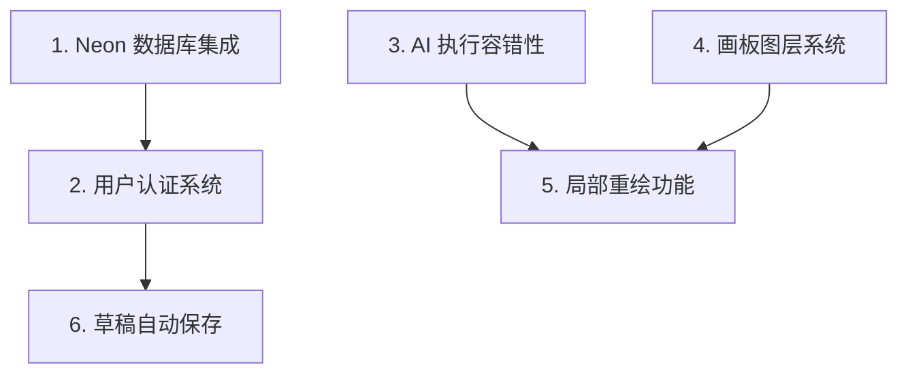

# 🎯 P0 阶段开发指南 - 核心体验

> **阶段目标**: 建立数据持久化基础设施和核心功能，为后续功能开发打下基础
>
> **预计周期**: 4-6 周
>
> **关联 Issue**: [#16 - 神笔马良 2.0 版本规划](https://github.com/qqyule/soul-canvas-ai/issues/16)

---

## 📋 开发顺序与依赖关系



> [!IMPORTANT] > **强烈建议按照上述顺序开发**，因为存在依赖关系：
>
> - 用户认证依赖数据库
> - 草稿保存依赖用户系统
> - 局部重绘依赖图层系统和 AI 容错

---

## 1️⃣ Neon 数据库集成

**分支**: `feature/neon-database`

**状态**: ✅ 已完成

### 功能范围

- [x] Neon PostgreSQL 接入配置
- [x] 核心数据模型设计
  - users (用户表)
  - artworks (作品表)
  - custom-styles (自定义风格表)
  - favorites (收藏表)
  - generation_logs (生成日志表)
- [x] Drizzle ORM 集成
- [x] 基础 CRUD 操作封装 (Repository 模式)
- [x] 环境变量配置
- [x] Zod 验证 Schema
- [x] 单元测试 (validators + repositories)

### 技术要点

```typescript
// 推荐的依赖
pnpm add @neondatabase/serverless drizzle-orm
pnpm add -D drizzle-kit
```

### 开发步骤

1. 注册 Neon 账户，创建数据库实例
2. 配置连接字符串到 `.env.local`
3. 设计并创建数据库 schema
4. 实现 Drizzle ORM 配置
5. 创建基础数据库操作工具函数
6. 编写单元测试

### 验收标准

- [x] 数据库连接成功
- [x] 基础表结构创建完成
- [x] CRUD 操作正常工作
- [x] 迁移脚本可用

---

## 2️⃣ 用户认证系统 (Auth)

**分支**: `feature/user-auth`

**状态**: ✅ 已完成

**依赖**: `feature/neon-database`

### 功能范围

- [x] GitHub OAuth 登录 (via Clerk)
- [x] Google OAuth 登录 (via Clerk)
- [ ] 邮箱密码登录（可选）
- [x] Session 管理 (Clerk)
- [x] JWT Token 机制 (Clerk)
- [x] 登录状态持久化
- [x] 退出登录功能
- [x] 用户数据同步到 Neon 数据库 (useUserSync hook)

### 技术要点

```typescript
// 推荐方案：Auth.js (NextAuth) 或 Clerk
// 如果使用 Auth.js:
pnpm add next-auth @auth/drizzle-adapter

// 如果使用 Clerk:
pnpm add @clerk/clerk-react
```

### 开发步骤

1. 选择并集成 Auth 服务
2. 配置 OAuth 应用（GitHub/Google）
3. 实现登录/注册页面
4. 添加受保护路由
5. 实现用户信息展示
6. 添加退出登录功能

### 验收标准

- [x] GitHub OAuth 登录成功
- [x] Google OAuth 登录成功
- [x] 用户信息正确存储到数据库
- [x] 刷新页面后登录状态保持
- [x] 退出登录正常工作

---

## 3️⃣ AI 执行容错性提升

**分支**: `feature/ai-error-handling`

**状态**: 🟡 开发中 (核心已完成)

### 功能范围

- [x] 智能重试机制（指数退避 + Jitter）
- [ ] 请求队列管理
- [ ] 进度反馈增强
- [x] 超时智能处理
- [x] 错误分类与友好提示 (基础实现)
- [ ] 网络状态检测

### 技术要点

```typescript
/**
 * 指数退避重试策略示例
 */
const retryWithBackoff = async <T>(
	fn: () => Promise<T>,
	maxRetries: number = 3,
	baseDelay: number = 1000
): Promise<T> => {
	for (let i = 0; i < maxRetries; i++) {
		try {
			return await fn()
		} catch (error) {
			if (i === maxRetries - 1) throw error
			const delay = baseDelay * Math.pow(2, i)
			await new Promise((resolve) => setTimeout(resolve, delay))
		}
	}
	throw new Error('Max retries exceeded')
}
```

### 开发步骤

1. 创建统一的 API 请求层
2. 实现重试机制
3. 添加请求队列管理
4. 实现进度反馈 UI
5. 添加错误类型分类
6. 编写错误处理单元测试

### 验收标准

- [x] 网络错误自动重试 (withRetry 已实现)
- [ ] 重试过程中显示进度
- [x] 不同错误类型显示不同提示 (基础实现)
- [ ] 用户可以取消正在进行的请求

---

## 4️⃣ 画板图层系统

**分支**: `feature/canvas-layer-system`

**状态**: 🟡 开发中

### 功能范围

- [ ] 多图层支持
- [ ] 图层添加/删除
- [ ] 图层顺序调整
- [ ] 图层锁定/解锁
- [ ] 图层显示/隐藏
- [ ] 图层透明度调节
- [ ] 图层混合模式（可选）

### 技术要点

```typescript
interface Layer {
	id: string
	name: string
	visible: boolean
	locked: boolean
	opacity: number
	blendMode?: string
	canvas: OffscreenCanvas
}

interface LayerState {
	layers: Layer[]
	activeLayerId: string | null
	addLayer: () => void
	removeLayer: (id: string) => void
	reorderLayers: (fromIndex: number, toIndex: number) => void
	// ...
}
```

### 开发步骤

1. 设计图层数据结构
2. 实现图层状态管理（推荐使用 Zustand）
3. 创建图层面板 UI
4. 实现图层合成渲染
5. 添加图层操作交互
6. 实现撤销/重做支持

### 验收标准

- [ ] 可以创建多个图层
- [ ] 图层可以重新排序
- [ ] 图层锁定后无法编辑
- [ ] 图层隐藏后不显示
- [ ] 导出时正确合成所有可见图层

---

## 5️⃣ 局部重绘功能 (Inpainting)

**分支**: `feature/inpainting`

**状态**: 🟡 开发中

**依赖**: `feature/canvas-layer-system`, `feature/ai-error-handling`

### 功能范围

- [ ] 选区工具（矩形/自由选区）
- [ ] 选区蒙版生成
- [ ] 局部重绘 API 调用
- [ ] 重绘结果合成
- [ ] 选区边缘羽化（可选）

### 技术要点

```typescript
/**
 * Inpainting 请求参数
 */
interface InpaintingRequest {
	originalImage: string // base64
	maskImage: string // base64，选区蒙版
	prompt: string
	negativePrompt?: string
}
```

### 开发步骤

1. 实现选区工具
2. 生成选区蒙版图像
3. 调用支持 inpainting 的 AI 模型
4. 将生成结果合成到原图
5. 添加边缘处理优化

### 验收标准

- [ ] 可以创建选区
- [ ] 选区内容可以重新生成
- [ ] 选区外内容保持不变
- [ ] 生成结果与原图自然融合

---

## 6️⃣ 草稿自动保存

**分支**: `feature/auto-save-draft`

**状态**: 🟡 开发中

**依赖**: `feature/neon-database`, `feature/user-auth`

### 功能范围

- [ ] 本地自动保存（IndexedDB）
- [ ] 云端自动同步（登录用户）
- [ ] 草稿恢复提示
- [ ] 草稿管理界面
- [ ] 保存状态指示器

### 技术要点

```typescript
/**
 * 草稿数据结构
 */
interface Draft {
  id: string;
  canvasData: string; // 画布数据
  styleId?: string;
  prompt?: string;
  createdAt: Date;
  updatedAt: Date;
  isLocal: boolean; // 是否仅存在于本地
}

// 推荐使用 Dexie.js 管理 IndexedDB
pnpm add dexie
```

### 开发步骤

1. 设计草稿数据结构
2. 实现本地存储（IndexedDB）
3. 添加自动保存触发逻辑
4. 实现云端同步（登录用户）
5. 添加草稿恢复提示
6. 创建草稿管理界面

### 验收标准

- [ ] 编辑时自动保存到本地
- [ ] 登录用户自动同步到云端
- [ ] 意外关闭后可恢复草稿
- [ ] 可以管理多个草稿

---

## 📊 进度追踪

| 功能            | 进度 | 状态      | 关键实现                          |
| --------------- | ---- | --------- | --------------------------------- |
| Neon 数据库集成 | 100% | ✅ 已完成 | Drizzle ORM + Schema + Repository |
| 用户认证系统    | 100% | ✅ 已完成 | Clerk + useUserSync               |
| AI 执行容错性   | 70%  | 🟡 开发中 | withRetry + 测试通过              |
| 画板图层系统    | 0%   | ⬜ 未开始 | -                                 |
| 局部重绘功能    | 0%   | ⬜ 未开始 | 依赖图层系统                      |
| 草稿自动保存    | 0%   | ⬜ 未开始 | 前置条件已满足                    |

---

## 📅 更新日志

| 日期       | 更新内容                                       |
| ---------- | ---------------------------------------------- |
| 2026-01-04 | 更新进度：数据库+认证已完成，AI 容错核心已实现 |
| 2026-01-03 | 初始化 P0 阶段开发指南                         |
