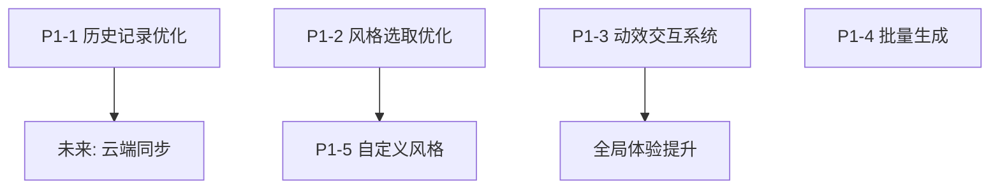

# 🚀 P1 阶段开发指南 - 差异化功能 (修订版)

> **阶段目标**: 提升产品竞争力，聚焦极致的用户交互体验与视觉表现力
>
> **预计周期**: 1-2 周
>
> **状态**: ⚪ 待开始
>
> **关联 Issue**: [#16 - 神笔马良 2.0 版本规划](https://github.com/qqyule/soul-canvas-ai/issues/16)

---

## 📋 功能模块概览

| 优先级 | 功能模块           | 分支                       | 状态      | 复杂度   |
| ------ | ------------------ | -------------------------- | --------- | -------- |
| P1-1   | 历史记录模块优化   | `feature/history-optimize` | ⚪ 待开始 | ⭐⭐⭐   |
| P1-2   | 风格选取 UI 优化   | `feature/style-ui-refine`  | ✅ 已完成 | ⭐⭐⭐   |
| P1-3   | 动效与交互增强系统 | `feature/interact-effects` | ⚪ 待开始 | ⭐⭐⭐⭐ |
| P1-4   | 批量生成 & 变体    | `feature/batch-generation` | ✅ 已完成 | ⭐⭐⭐   |
| P1-5   | 自定义风格         | `feature/custom-styles`    | ⚪ 待开始 | ⭐⭐⭐   |

---

## 📊 开发依赖关系



> [!IMPORTANT] > **推荐开发顺序**:
>
> 1. **历史记录优化**: 确保核心数据流的顺畅，方便用户回溯。
> 2. **风格选取 UI 优化**: 提升生成前置体验。
> 3. **动效与交互增强系统**: 贯穿整个开发周期，为各个按钮和交互添加 Premium 感。
> 4. **批量生成 & 变体**: 提升生产力。
> 5. **自定义风格**: 进阶功能。

---

## 1️⃣ 历史记录模块优化

**分支**: `feature/history-optimize`

**状态**: ⚪ 待开始

### 功能范围

- [ ] **视觉升级**: 将简单的列表升级为瀑布流或网格卡片展示。
- [ ] **多维过滤**: 支持按风格、时间范围、关键词进行筛选。
- [ ] **批量操作**: 选择多项进行删除、批量下载或对比。
- [ ] **细节增强**: 鼠标悬停显示生成参数（Prompt, Style, Seed 等）。
- [ ] **性能优化**: 实现无限滚动（Virtualized List），避免大量数据卡顿。

### 技术方案

```typescript
/**
 * 历史记录过滤配置
 */
interface HistoryFilter {
	styleId?: string
	startDate?: number
	endDate?: number
	searchQuery?: string
	sortBy: 'latest' | 'oldest' | 'rating'
}

/**
 * 增强型作品项 (基于现有 neon-database schema)
 */
interface EnhancedArtworkItem {
	id: string
	imageUrl: string
	thumbnailUrl: string
	params: {
		prompt: string
		styleId: string
		seed: number
		strength: number
	}
	createdAt: number
}
```

### 开发步骤

1. 重构 `HistoryPanel.tsx`，使用 `react-window` 或 `tanstack-virtual` 实现长列表优化。
2. 添加 `FilterBar.tsx` 支持多维度搜索和过滤。
3. 实现 `SelectionModel` 支持复选和批量操作逻辑。
4. 优化本地存储与云端数据合并的加载策略。

---

## 2️⃣ 风格选取 UI 优化 (Style Selector)

**分支**: `feature/style-ui-refine`

**状态**: ✅ 已完成

### 功能范围

- [x] **图片示例**: 每个风格按钮需配一张极具代表性的 AI 生成预览图。
- [x] **悬停预览**: 悬停在风格按钮上时，展示更大尺寸的示例图及风格说明。
- [x] **分类导航**: (已移除) 统一展示，不再分 tabs。
- [x] **选中态增强**: 选中风格时，按钮应有独特的呼吸灯或边框动效。

### 设计参考 (风格图片)

| 风格名称        | 预览图示例 (推荐方向)            |
| :-------------- | :------------------------------- |
| **赛博朋克**    | 霓虹灯火的未来都市街道，雨夜质感 |
| **中国风/水墨** | 泼墨挥毫的山水或龙凤，宣纸纹理   |
| **3D 渲染**     | 粘土质感或皮克斯风格的立体角色   |
| **极简手绘**    | 简单的黑白线条，极具设计感的留白 |

### 开发步骤

1. 准备风格库静态资源（图片素材需符合 Premium 设计感）。
2. 构建 `StyleGrid.tsx`，采用响应式布局展示风格卡片。
3. 实现 `HoverCard` 效果，展示大图和风格详情。
4. 集成到主画板的配置面板中。

---

## 3️⃣ 动效与交互增强系统 (Premium Interactions)

**分支**: `feature/interact-effects`

**状态**: ⚪ 待开始

### 功能范围

- [ ] **按钮微动效 (Micro-interactions)**:
  - 点击时的涟漪或回弹效果（Spring Animation）。
  - 各类功能按钮（生成、保存、分享）的交互反馈动效。
- [ ] **页面与面板动效**:
  - 侧边栏滑出的弹性效果。
  - 画布生成时的加载进度条粒子化（结合 Three.js 或 Framer Motion）。
- [ ] **全局交互反馈**:
  - 非侵入式吐司提示 (Sonner) 的滑入滑出。
  - 元素点击或触摸时的视觉粒子反馈（喷溅效果）。
- [ ] **3D 效果集成**:
  - Three.js 粒子背景（保持原有基础）。

### 技术方案

```typescript
// 核心工具推荐
// pnpm add framer-motion lucide-react sonner

/**
 * 通用弹跳动画配置
 */
export const springTransition = {
	type: 'spring',
	stiffness: 300,
	damping: 20,
}

/**
 * 按钮点击动效封装示例 (Framer Motion)
 */
const MotionButton = ({ children, onClick }) => (
	<motion.button
		whileHover={{ scale: 1.05 }}
		whileTap={{ scale: 0.95 }}
		transition={springTransition}
		onClick={onClick}
		className="..."
	>
		{children}
	</motion.button>
)
```

### 开发步骤

1. 搭建全局动效规范（定义 Spring 逻辑、持续时间、Ease 曲线）。
2. 批量替换核心按钮（如主页面操作按钮）为带交互动效的组件。
3. 实现 `PageTransition` 组件，封装跨页面切入切出效果。
4. 在生成请求期间，通过 Three.js 注入动态粒子交互，增强“正在创作”的视觉沉浸感。

---

## 4️⃣ 批量生成 & 变体

**分支**: `feature/batch-generation`

**状态**: ✅ 已完成

### 功能范围

- [x] 一次生成多个变体 (1-4 张)
- [x] 并行生成队列管理
- [x] 生成结果网格预览
- [x] 单张选择 / 全部下载保存

---

## 5️⃣ 自定义风格

**分支**: `feature/custom-styles`

**状态**: ⚪ 待开始

---

## 📎 相关资源

- **P0 开发指南**: [P0-DEV-GUIDE.md](./P0-DEV-GUIDE.md)
- **开发路线图**: [DEV-ROADMAP.md](./DEV-ROADMAP.md)

---

## 📅 更新日志

| 日期       | 更新内容                                                                         |
| ---------- | -------------------------------------------------------------------------------- |
| 2026-01-04 | 修订 P1 规划：移除图层、重绘、快捷键；新增历史记录、风格 UI 优化及全方位交互动效 |
| 2026-01-04 | 初始化 P1 阶段开发指南                                                           |
