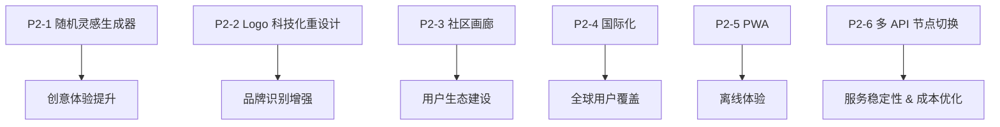

# 🌟 P2 阶段开发指南 - 生态建设与创意增强

> **阶段目标**: 完善产品生态，提升创意体验，增加用户粘性
>
> **预计周期**: 2-3 周
>
> **状态**: ⚪ 待开始
>
> **关联 Issue**: [#16 - 神笔马良 2.0 版本规划](https://github.com/qqyule/soul-canvas-ai/issues/16)

---

## 📋 功能模块概览

| 优先级 | 功能模块          | 分支                         | 状态      | 复杂度   |
| ------ | ----------------- | ---------------------------- | --------- | -------- |
| P2-1   | 随机灵感生成器    | `feature/random-inspiration` | ⚪ 待开始 | ⭐⭐⭐   |
| P2-2   | Logo 科技化重设计 | `feature/logo-redesign`      | ✅ 已完成 | ⭐⭐     |
| P2-3   | 作品集 & 社区画廊 | `feature/community-gallery`  | ⚪ 待开始 | ⭐⭐⭐⭐ |
| P2-4   | 国际化支持 (i18n) | `feature/i18n`               | ⚪ 待开始 | ⭐⭐⭐   |
| P2-5   | PWA 离线支持      | `feature/pwa`                | ⚪ 待开始 | ⭐⭐⭐   |
| P2-6   | 多 API 节点切换   | `feature/multi-api-node`     | 🔵 进行中 | ⭐⭐⭐   |

---

## 📊 开发依赖关系



> [!IMPORTANT] > **推荐开发顺序**:
>
> 1. **多 API 节点切换**: 提升服务稳定性，优化成本控制，**优先完成**。
> 2. **随机灵感生成器**: 提升创意体验，帮助用户快速开始创作。
> 3. **Logo 科技化重设计**: 增强品牌识别度，体现产品技术属性。
> 4. **社区画廊**: 构建用户社区，增加产品粘性。
> 5. **国际化支持**: 拓展全球用户群体。
> 6. **PWA 离线支持**: 提升移动端体验。

---

## 1️⃣ 随机灵感生成器

**分支**: `feature/random-inspiration`

**状态**: ⚪ 待开始

### 功能范围

- [ ] **随机线条生成**: 在画布上自动生成艺术性线条图案
  - 几何形状组合（三角形、圆形、多边形嵌套）
  - 曲线艺术（贝塞尔曲线、波浪线、螺旋线）
  - 抽象图案（分形结构、有机形态）
  - 简笔画轮廓（动物、植物、物体的简化线条）
- [ ] **智能提示词联想**: 根据生成的线条特征，自动推荐相关提示词
- [ ] **灵感模板库**: 预设多种创意模板供用户选择
- [ ] **一键清空 & 重新生成**: 快速迭代灵感

### 设计理念

> 帮助有"创作障碍"的用户快速打破空白画布的恐惧，提供艺术性和识别度兼具的起点。

### 线条生成算法策略

```typescript
/**
 * 随机灵感生成配置
 */
interface InspirationConfig {
  type: 'geometric' | 'organic' | 'sketch' | 'pattern'
  complexity: 'simple' | 'medium' | 'complex'
  style: 'minimalist' | 'abstract' | 'decorative'
}

/**
 * 线条生成结果
 */
interface InspirationResult {
  paths: CanvasPath[]           // ReactSketchCanvas 兼容的路径数据
  suggestedPrompts: string[]    // 推荐的提示词列表
  previewThumbnail: string      // Base64 缩略图
}

/**
 * 几何形状生成器示例
 */
const geometricPatterns = {
  // 同心圆
  concentricCircles: (centerX: number, centerY: number, count: number) => {...},
  // 蜂巢六边形
  honeycomb: (startX: number, startY: number, size: number, rows: number, cols: number) => {...},
  // 曼陀罗图案
  mandala: (centerX: number, centerY: number, layers: number, symmetry: number) => {...},
  // 几何山峦
  geometricMountains: (width: number, height: number, peaks: number) => {...},
}

/**
 * 有机形态生成器示例
 */
const organicPatterns = {
  // 波浪线组
  waves: (startY: number, amplitude: number, frequency: number, count: number) => {...},
  // 树枝分形
  treeBranch: (startX: number, startY: number, depth: number, angle: number) => {...},
  // 流体曲线
  fluidCurves: (points: number, smoothness: number) => {...},
}

/**
 * 简笔画轮廓生成器
 */
const sketchOutlines = {
  // 简化动物轮廓（猫、狗、兔子、鸟等）
  animal: (type: 'cat' | 'dog' | 'bird' | 'fish', scale: number) => {...},
  // 简化植物轮廓（花、树、叶子等）
  plant: (type: 'flower' | 'tree' | 'leaf', scale: number) => {...},
  // 简化物体轮廓（房子、车、杯子等）
  object: (type: 'house' | 'car' | 'cup', scale: number) => {...},
}
```

### 提示词联想逻辑

```typescript
/**
 * 根据生成的图案类型和复杂度推荐提示词
 */
const promptSuggestions: Record<string, string[]> = {
	// 几何图案相关
	geometric: ['未来城市的蓝图', '科幻建筑设计', '抽象艺术装置', '数字迷宫'],
	// 有机形态相关
	organic: ['梦境中的森林', '海洋深处的生物', '外星植物', '流动的音乐'],
	// 简笔画相关
	sketch: ['童话故事插画', '极简风格头像', '手绘风格海报', '可爱的卡通形象'],
	// 图案纹理相关
	pattern: ['复古壁纸设计', '民族风格纹样', '现代装饰艺术', '传统文化图案'],
}
```

### UI 组件设计

```tsx
/**
 * 随机灵感按钮组件
 */
interface RandomInspirationButtonProps {
	onGenerate: (result: InspirationResult) => void
	disabled?: boolean
}

/**
 * 灵感选项面板
 */
interface InspirationPanelProps {
	config: InspirationConfig
	onConfigChange: (config: InspirationConfig) => void
	onApply: () => void
	onCancel: () => void
}
```

### 开发步骤

1. 创建 `src/lib/inspiration-generator.ts` 实现线条生成算法
2. 实现 `src/components/canvas/RandomInspirationButton.tsx` UI 组件
3. 创建 `src/components/canvas/InspirationPanel.tsx` 配置面板
4. 在 `SketchCanvas.tsx` 中集成随机生成功能
5. 实现提示词联想并与 PromptInput 联动
6. 添加生成动画效果（线条逐渐绘制）

### 验收标准

- [ ] 点击按钮后在画布上生成视觉有趣的线条
- [ ] 生成的线条风格多样，具有艺术性
- [ ] 自动推荐与线条匹配的提示词
- [ ] 支持多种复杂度和风格选择
- [ ] 生成过程有流畅的动画效果

---

## 2️⃣ Logo 科技化重设计

**分支**: `feature/logo-redesign`

**状态**: ✅ 已完成

### 功能范围

- [ ] **Logo 视觉重设计**: 融入 AI、神笔、创作元素
- [ ] **动态 Logo 效果**: 悬停/加载时的粒子/光效动画
- [ ] **响应式适配**: 不同尺寸下的 Logo 变体
- [ ] **主题适应**: 深色/浅色模式下的 Logo 配色

### 设计理念

> 将"神笔马良"的传统文化内涵与现代 AI 科技感融合，体现"一笔成画"的核心价值。

### 视觉元素参考

| 元素         | 设计方向                                     |
| ------------ | -------------------------------------------- |
| **核心符号** | 融合毛笔笔尖 + AI 神经网络节点的抽象图形     |
| **色彩**     | 渐变色系（紫-蓝-青），科技感霓虹光效         |
| **形态**     | 简洁几何化，可延展为粒子/光线动态效果        |
| **文化融合** | 保留"神笔马良"的东方韵味，同时具备科技未来感 |

### 技术方案

```tsx
/**
 * 动态 Logo 组件
 */
interface DynamicLogoProps {
	size?: 'sm' | 'md' | 'lg'
	animated?: boolean
	variant?: 'full' | 'icon' | 'text'
	theme?: 'light' | 'dark' | 'auto'
}

/**
 * Logo 动画状态
 */
type LogoAnimationState = 'idle' | 'hover' | 'loading' | 'active'

/**
 * SVG + Framer Motion 实现动态效果
 */
const AnimatedLogo = ({ size, animated }: DynamicLogoProps) => {
	return (
		<motion.svg
			viewBox="0 0 48 48"
			whileHover={{ scale: 1.05 }}
			// 粒子发散效果
			// 神经网络连线动画
			// 渐变色流动效果
		>
			{/* 主体图形：笔尖 + 节点融合 */}
			{/* 动态光效层 */}
			{/* 粒子效果层 */}
		</motion.svg>
	)
}
```

### Logo 变体规格

| 变体        | 尺寸    | 使用场景                 |
| ----------- | ------- | ------------------------ |
| **Full**    | 160px+  | 首页 Hero 区域、关于页面 |
| **Icon**    | 32-48px | Header 导航栏、移动端    |
| **Favicon** | 16-32px | 浏览器标签页、PWA 图标   |
| **Social**  | 按平台  | 社交分享 OG Image        |

### 开发步骤

1. 设计 Logo 概念稿（可使用 AI 辅助设计 + 手动调优）
2. 创建 SVG 矢量图形，确保可无损缩放
3. 实现 `src/components/brand/AnimatedLogo.tsx` 动态组件
4. 替换 `Header.tsx` 中的现有 Logo
5. 更新 Favicon 和 PWA 应用图标
6. 生成社交分享 OG Image 模板

### 验收标准

- [ ] Logo 视觉具有科技感和品牌识别度
- [ ] 悬停时有流畅的动态效果
- [ ] 适配深浅色两种主题
- [ ] 所有尺寸变体清晰可辨
- [ ] Favicon 和 PWA 图标同步更新

---

## 3️⃣ 作品集 & 社区画廊

**分支**: `feature/community-gallery`

**状态**: ✅ 已完成

### 功能范围

- [x] **社区画廊 (Community Gallery)**:
  - 瀑布流布局展示公开作品 (`MasonryGrid` 组件)
  - 支持按"最新"、"热门"、"趋势"筛选 (`FilterBar` 组件)
  - 无限滚动加载 (IntersectionObserver)
- [x] **作品详情页 (Artwork Detail)**:
  - 高清大图查看 (`ArtworkDetailDialog` 弹窗)
  - 提示词与生成参数展示
  - "同款生成" (Remix) 按钮（UI 已就绪）
- [x] **互动功能**:
  - 点赞/取消点赞（乐观更新）
  - 浏览量统计
  - 分享到社交媒体（Web Share API + 剪贴板降级）
- [x] **个人主页 (User Profile)**:
  - 展示个人发布的作品
  - 展示获赞总数
  - ~~简单的个人信息编辑~~（未实现，非核心功能）

### 已实现的文件结构

```
src/
├── types/community.ts          # 类型定义
├── lib/community-service.ts    # API 服务
├── hooks/use-community.ts      # React Hooks
├── components/community/
│   ├── index.ts
│   ├── ArtworkCard.tsx         # 作品卡片
│   ├── MasonryGrid.tsx         # 瀑布流网格
│   ├── FilterBar.tsx           # 筛选栏
│   └── ArtworkDetailDialog.tsx # 详情弹窗
└── pages/Community.tsx         # 社区页面
```

### 数据库设计 (Schema Design)

> 实际使用 PostgreSQL (Neon) + Drizzle ORM

```typescript
// src/db/schema/artworks.ts
export const artworks = pgTable('artworks', {
	id: uuid('id').primaryKey().defaultRandom(),
	userId: varchar('user_id', { length: 255 }).notNull(),
	resultUrl: text('result_url').notNull(),
	thumbnailUrl: text('thumbnail_url'),
	prompt: text('prompt'),
	styleId: text('style_id').notNull(),
	styleName: text('style_name'),
	width: integer('width'),
	height: integer('height'),
	views: integer('views').default(0),
	likes: integer('likes').default(0),
	isPublic: boolean('is_public').default(false),
	isDraft: boolean('is_draft').default(false),
	createdAt: timestamp('created_at').notNull().defaultNow(),
	updatedAt: timestamp('updated_at').notNull().defaultNow(),
})

// src/db/schema/favorites.ts (点赞表)
export const favorites = pgTable(
	'favorites',
	{
		userId: text('user_id')
			.notNull()
			.references(() => users.id),
		artworkId: uuid('artwork_id')
			.notNull()
			.references(() => artworks.id),
		createdAt: timestamp('created_at').notNull().defaultNow(),
	},
	(table) => ({
		pk: primaryKey({ columns: [table.userId, table.artworkId] }),
	})
)
```

### 路由配置

| 路由               | 组件            | 描述         |
| :----------------- | :-------------- | :----------- |
| `/#/community`     | `CommunityPage` | 社区画廊列表 |
| `/#/community/:id` | `CommunityPage` | 作品详情弹窗 |
| `/#/user/:userId`  | `CommunityPage` | 用户资料页   |

### 发布入口

- `GenerationResultView` 组件新增 **"发布到社区"** 按钮
- 发布成功后按钮变为 **"已发布"** 状态

---

## 4️⃣ 国际化支持 (i18n)

**分支**: `feature/i18n`

**状态**: ⚪ 待开始

### 功能范围

- [ ] i18n 框架集成 (react-i18next)
- [ ] 中英文语言包
- [ ] 语言切换 UI
- [ ] RTL 布局支持（可选）

---

## 5️⃣ PWA 离线支持

**分支**: `feature/pwa`

**状态**: ⚪ 待开始

### 功能范围

- [ ] Service Worker 配置
- [ ] 离线页面缓存
- [ ] 应用安装提示
- [ ] 离线功能降级

---

## 6️⃣ 多 API 节点切换

**分支**: `feature/multi-api-node`

**状态**: ✅ 已完成

### 功能范围

- [ ] **多节点配置**: 支持配置多个 API 服务节点
- [ ] **客户端测速**: 用户端自动 ping 测试各节点延迟
- [ ] **智能路由**: 根据测速结果自动选择最优节点
- [ ] **故障转移**: 主节点不可用时自动切换到备用节点
- [ ] **成本优化**: 根据服务商定价策略合理分配请求

### 设计理念

> 通过多节点策略提升服务稳定性和响应速度，同时实现成本优化。以 kie.ai 节点为主，OpenRouter 为稳定备用。

### 节点配置

| 节点       | 服务商     | 角色     | API 端点                       | 说明                   |
| ---------- | ---------- | -------- | ------------------------------ | ---------------------- |
| **主节点** | kie.ai     | Primary  | `https://api.kie.ai/api/v1`    | 异步任务模式，成本更低 |
| **备用**   | OpenRouter | Fallback | `https://openrouter.ai/api/v1` | 同步模式，模型丰富     |

### kie.ai API 说明

> **官方文档**: [https://docs.kie.ai/market/google/nano-banana-edit](https://docs.kie.ai/market/google/nano-banana-edit)

**模型**: `google/nano-banana-edit` (Nano Banana Edit - 图像编辑模型)

**API 模式**: **异步任务** (需轮询或回调获取结果)

#### 创建任务请求

```bash
curl --request POST \
  --url https://api.kie.ai/api/v1/jobs/createTask \
  --header 'Authorization: Bearer ${API_KEY}' \
  --header 'Content-Type: application/json' \
  --data '{
    "model": "google/nano-banana-edit",
    "callBackUrl": "https://your-domain.com/api/callback",
    "input": {
      "prompt": "your style prompt here",
      "image_urls": ["https://example.com/sketch.png"],
      "output_format": "png",
      "image_size": "1:1"
    }
  }'
```

#### 响应示例

```json
{
	"code": 200,
	"msg": "success",
	"data": {
		"taskId": "task_google_1765178615729"
	}
}
```

#### 响应码说明

| 状态码 | 含义                  |
| ------ | --------------------- |
| 200    | 成功                  |
| 401    | 未授权 - 认证信息无效 |
| 402    | 余额不足              |
| 429    | 请求过频              |
| 500    | 服务器错误            |
| 501    | 生成失败              |

#### 轮询任务结果

由于 kie.ai 为**异步任务模式**，创建任务后需要轮询 `/api/v1/jobs/recordInfo` 接口获取生成结果：

```bash
curl --request GET \
  --url "https://api.kie.ai/api/v1/jobs/recordInfo?taskId=${TASK_ID}" \
  --header 'Authorization: Bearer ${API_KEY}'
```

**响应示例（生成中）**:

```json
{
	"code": 200,
	"msg": "success",
	"data": {
		"taskId": "task_google_1765178615729",
		"status": "processing"
	}
}
```

**响应示例（生成完成）**:

```json
{
	"code": 200,
	"msg": "success",
	"data": {
		"taskId": "task_google_1765178615729",
		"status": "completed",
		"output": {
			"image_urls": ["https://...generated-image.png"]
		}
	}
}
```

**轮询策略建议**:

- 首次延迟：2 秒后开始轮询
- 轮询间隔：每 3 秒查询一次
- 最大轮询时间：60 秒
- 超时处理：显示生成超时提示

### 测速接口

```bash
# kie.ai 节点测速（使用 credit 查询接口）
curl --request GET \
  --url https://api.kie.ai/api/v1/chat/credit \
  --header 'Authorization: Bearer ${API_KEY}'

# OpenRouter 节点测速
curl https://openrouter.ai/api/v1/credits \
  -H "Authorization: Bearer ${API_KEY}"
```

### 技术方案

```typescript
/**
 * API 节点配置
 */
interface APINode {
	id: string // 节点唯一标识
	name: string // 显示名称
	baseUrl: string // API 基础 URL
	healthEndpoint: string // 测速/健康检查端点
	priority: number // 优先级（越小越优先）
	enabled: boolean // 是否启用
	mode: 'sync' | 'async' // 同步/异步模式
	model?: string // 使用的模型
}

/**
 * kie.ai 异步任务创建请求
 */
interface KieCreateTaskRequest {
	model: string // 模型名称，如 "google/nano-banana-edit"
	callBackUrl?: string // 可选回调 URL
	input: {
		prompt: string // 提示词
		image_urls: string[] // 输入图像 URL 列表
		output_format?: 'png' | 'jpeg' | 'webp'
		image_size?: '1:1' | '16:9' | '9:16' | '4:3' | '3:4'
	}
}

/**
 * kie.ai 任务创建响应
 */
interface KieCreateTaskResponse {
	code: number
	msg: string
	data: {
		taskId: string // 任务 ID，用于后续轮询
	}
}

/**
 * 节点健康状态
 */
interface NodeHealth {
	nodeId: string
	latency: number // 延迟（ms）
	isAvailable: boolean // 是否可用
	lastChecked: Date // 最后检测时间
	consecutiveFailures: number // 连续失败次数
}

/**
 * 节点选择策略
 */
type NodeSelectionStrategy = 'latency' | 'priority' | 'round-robin'

/**
 * 节点管理器配置
 */
interface NodeManagerConfig {
	nodes: APINode[]
	strategy: NodeSelectionStrategy
	healthCheckInterval: number // 健康检查间隔（ms）
	failoverThreshold: number // 故障转移阈值（连续失败次数）
	cacheTimeout: number // 测速结果缓存时间（ms）
}
```

### 节点管理器实现

```typescript
/**
 * API 节点管理器
 * 负责测速、选择、故障转移
 */
class APINodeManager {
	private nodes: Map<string, APINode>
	private health: Map<string, NodeHealth>
	private config: NodeManagerConfig

	/**
	 * 测速单个节点
	 */
	async pingNode(nodeId: string): Promise<NodeHealth> {
		const node = this.nodes.get(nodeId)
		const startTime = performance.now()

		try {
			const response = await fetch(node.healthEndpoint, {
				method: 'GET',
				headers: { Authorization: `Bearer ${getApiKey(nodeId)}` },
				signal: AbortSignal.timeout(5000), // 5秒超时
			})

			const latency = performance.now() - startTime
			return {
				nodeId,
				latency,
				isAvailable: response.ok,
				lastChecked: new Date(),
				consecutiveFailures: 0,
			}
		} catch (error) {
			return {
				nodeId,
				latency: Infinity,
				isAvailable: false,
				lastChecked: new Date(),
				consecutiveFailures:
					(this.health.get(nodeId)?.consecutiveFailures ?? 0) + 1,
			}
		}
	}

	/**
	 * 测速所有节点并返回最优节点
	 */
	async selectBestNode(): Promise<APINode> {
		const healthResults = await Promise.all(
			Array.from(this.nodes.values())
				.filter((n) => n.enabled)
				.map((n) => this.pingNode(n.id))
		)

		// 更新健康状态缓存
		healthResults.forEach((h) => this.health.set(h.nodeId, h))

		// 根据策略选择节点
		const availableNodes = healthResults
			.filter((h) => h.isAvailable)
			.sort((a, b) => {
				if (this.config.strategy === 'latency') {
					return a.latency - b.latency
				}
				const nodeA = this.nodes.get(a.nodeId)!
				const nodeB = this.nodes.get(b.nodeId)!
				return nodeA.priority - nodeB.priority
			})

		if (availableNodes.length === 0) {
			throw new Error('所有 API 节点均不可用')
		}

		return this.nodes.get(availableNodes[0].nodeId)!
	}
}
```

### 环境变量配置

```bash
# .env.local

# kie.ai（主节点）
VITE_KIE_API_KEY=your_kie_api_key_here
VITE_KIE_BASE_URL=https://api.kie.ai/api/v1

# OpenRouter（备用节点）
VITE_OPENROUTER_API_KEY=your_openrouter_key_here
VITE_OPENROUTER_BASE_URL=https://openrouter.ai/api/v1

# 节点选择策略: latency | priority | round-robin
VITE_NODE_SELECTION_STRATEGY=priority
```

### 开发步骤

1. 创建 `src/lib/api-node-manager.ts` 实现节点管理逻辑
2. 创建 `src/lib/kie-client.ts` 封装 kie.ai API 调用
3. 重构 `src/lib/openrouter.ts` 为通用 API 客户端接口
4. 创建 `src/lib/api-client-factory.ts` 统一客户端工厂
5. 修改 `src/lib/ai-service.ts` 集成节点选择逻辑
6. 实现测速结果本地缓存（localStorage / sessionStorage）
7. 添加节点状态 UI 指示器（可选）

### 验收标准

- [ ] 应用启动时自动测速所有配置节点
- [ ] 以 kie.ai 为主节点，OpenRouter 为备用
- [ ] 主节点不可用时自动切换到备用节点
- [ ] 测速结果缓存，避免频繁请求
- [ ] 提供控制台日志显示当前使用节点
- [ ] 所有现有图像生成功能正常工作

> [!WARNING] > **安全提示**: kie.ai 的 API_KEY 为敏感信息，请确保只在 `.env.local` 中配置，切勿提交到 Git 仓库。

---

## 📎 相关资源

- **P0 开发指南**: [P0-DEV-GUIDE.md](./P0-DEV-GUIDE.md)
- **P1 开发指南**: [P1-DEV-GUIDE.md](./P1-DEV-GUIDE.md)
- **开发路线图**: [DEV-ROADMAP.md](./DEV-ROADMAP.md)

---

## 📅 更新日志

| 日期       | 更新内容                                                     |
| ---------- | ------------------------------------------------------------ |
| 2026-01-04 | 添加 P2-6 多 API 节点切换功能，以 kie.ai 为主节点            |
| 2026-01-04 | 初始化 P2 阶段开发指南，添加随机灵感生成器和 Logo 重设计功能 |
