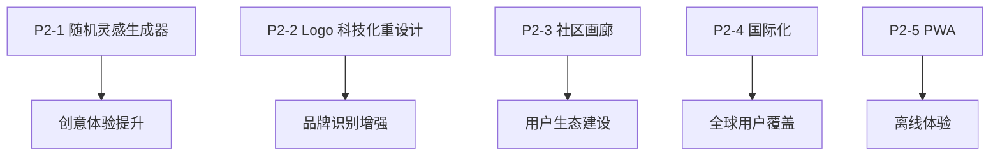

# 🌟 P2 阶段开发指南 - 生态建设与创意增强

> **阶段目标**: 完善产品生态，提升创意体验，增加用户粘性
>
> **预计周期**: 2-3 周
>
> **状态**: ⚪ 待开始
>
> **关联 Issue**: [#16 - 神笔马良 2.0 版本规划](https://github.com/qqyule/soul-canvas-ai/issues/16)

---

## 📋 功能模块概览

| 优先级 | 功能模块          | 分支                         | 状态      | 复杂度   |
| ------ | ----------------- | ---------------------------- | --------- | -------- |
| P2-1   | 随机灵感生成器    | `feature/random-inspiration` | ⚪ 待开始 | ⭐⭐⭐   |
| P2-2   | Logo 科技化重设计 | `feature/logo-redesign`      | ⚪ 待开始 | ⭐⭐     |
| P2-3   | 作品集 & 社区画廊 | `feature/community-gallery`  | ⚪ 待开始 | ⭐⭐⭐⭐ |
| P2-4   | 国际化支持 (i18n) | `feature/i18n`               | ⚪ 待开始 | ⭐⭐⭐   |
| P2-5   | PWA 离线支持      | `feature/pwa`                | ⚪ 待开始 | ⭐⭐⭐   |

---

## 📊 开发依赖关系



> [!IMPORTANT] > **推荐开发顺序**:
>
> 1. **随机灵感生成器**: 提升创意体验，帮助用户快速开始创作。
> 2. **Logo 科技化重设计**: 增强品牌识别度，体现产品技术属性。
> 3. **社区画廊**: 构建用户社区，增加产品粘性。
> 4. **国际化支持**: 拓展全球用户群体。
> 5. **PWA 离线支持**: 提升移动端体验。

---

## 1️⃣ 随机灵感生成器

**分支**: `feature/random-inspiration`

**状态**: ⚪ 待开始

### 功能范围

- [ ] **随机线条生成**: 在画布上自动生成艺术性线条图案
  - 几何形状组合（三角形、圆形、多边形嵌套）
  - 曲线艺术（贝塞尔曲线、波浪线、螺旋线）
  - 抽象图案（分形结构、有机形态）
  - 简笔画轮廓（动物、植物、物体的简化线条）
- [ ] **智能提示词联想**: 根据生成的线条特征，自动推荐相关提示词
- [ ] **灵感模板库**: 预设多种创意模板供用户选择
- [ ] **一键清空 & 重新生成**: 快速迭代灵感

### 设计理念

> 帮助有"创作障碍"的用户快速打破空白画布的恐惧，提供艺术性和识别度兼具的起点。

### 线条生成算法策略

```typescript
/**
 * 随机灵感生成配置
 */
interface InspirationConfig {
  type: 'geometric' | 'organic' | 'sketch' | 'pattern'
  complexity: 'simple' | 'medium' | 'complex'
  style: 'minimalist' | 'abstract' | 'decorative'
}

/**
 * 线条生成结果
 */
interface InspirationResult {
  paths: CanvasPath[]           // ReactSketchCanvas 兼容的路径数据
  suggestedPrompts: string[]    // 推荐的提示词列表
  previewThumbnail: string      // Base64 缩略图
}

/**
 * 几何形状生成器示例
 */
const geometricPatterns = {
  // 同心圆
  concentricCircles: (centerX: number, centerY: number, count: number) => {...},
  // 蜂巢六边形
  honeycomb: (startX: number, startY: number, size: number, rows: number, cols: number) => {...},
  // 曼陀罗图案
  mandala: (centerX: number, centerY: number, layers: number, symmetry: number) => {...},
  // 几何山峦
  geometricMountains: (width: number, height: number, peaks: number) => {...},
}

/**
 * 有机形态生成器示例
 */
const organicPatterns = {
  // 波浪线组
  waves: (startY: number, amplitude: number, frequency: number, count: number) => {...},
  // 树枝分形
  treeBranch: (startX: number, startY: number, depth: number, angle: number) => {...},
  // 流体曲线
  fluidCurves: (points: number, smoothness: number) => {...},
}

/**
 * 简笔画轮廓生成器
 */
const sketchOutlines = {
  // 简化动物轮廓（猫、狗、兔子、鸟等）
  animal: (type: 'cat' | 'dog' | 'bird' | 'fish', scale: number) => {...},
  // 简化植物轮廓（花、树、叶子等）
  plant: (type: 'flower' | 'tree' | 'leaf', scale: number) => {...},
  // 简化物体轮廓（房子、车、杯子等）
  object: (type: 'house' | 'car' | 'cup', scale: number) => {...},
}
```

### 提示词联想逻辑

```typescript
/**
 * 根据生成的图案类型和复杂度推荐提示词
 */
const promptSuggestions: Record<string, string[]> = {
	// 几何图案相关
	geometric: ['未来城市的蓝图', '科幻建筑设计', '抽象艺术装置', '数字迷宫'],
	// 有机形态相关
	organic: ['梦境中的森林', '海洋深处的生物', '外星植物', '流动的音乐'],
	// 简笔画相关
	sketch: ['童话故事插画', '极简风格头像', '手绘风格海报', '可爱的卡通形象'],
	// 图案纹理相关
	pattern: ['复古壁纸设计', '民族风格纹样', '现代装饰艺术', '传统文化图案'],
}
```

### UI 组件设计

```tsx
/**
 * 随机灵感按钮组件
 */
interface RandomInspirationButtonProps {
	onGenerate: (result: InspirationResult) => void
	disabled?: boolean
}

/**
 * 灵感选项面板
 */
interface InspirationPanelProps {
	config: InspirationConfig
	onConfigChange: (config: InspirationConfig) => void
	onApply: () => void
	onCancel: () => void
}
```

### 开发步骤

1. 创建 `src/lib/inspiration-generator.ts` 实现线条生成算法
2. 实现 `src/components/canvas/RandomInspirationButton.tsx` UI 组件
3. 创建 `src/components/canvas/InspirationPanel.tsx` 配置面板
4. 在 `SketchCanvas.tsx` 中集成随机生成功能
5. 实现提示词联想并与 PromptInput 联动
6. 添加生成动画效果（线条逐渐绘制）

### 验收标准

- [ ] 点击按钮后在画布上生成视觉有趣的线条
- [ ] 生成的线条风格多样，具有艺术性
- [ ] 自动推荐与线条匹配的提示词
- [ ] 支持多种复杂度和风格选择
- [ ] 生成过程有流畅的动画效果

---

## 2️⃣ Logo 科技化重设计

**分支**: `feature/logo-redesign`

**状态**: ⚪ 待开始

### 功能范围

- [ ] **Logo 视觉重设计**: 融入 AI、神笔、创作元素
- [ ] **动态 Logo 效果**: 悬停/加载时的粒子/光效动画
- [ ] **响应式适配**: 不同尺寸下的 Logo 变体
- [ ] **主题适应**: 深色/浅色模式下的 Logo 配色

### 设计理念

> 将"神笔马良"的传统文化内涵与现代 AI 科技感融合，体现"一笔成画"的核心价值。

### 视觉元素参考

| 元素         | 设计方向                                     |
| ------------ | -------------------------------------------- |
| **核心符号** | 融合毛笔笔尖 + AI 神经网络节点的抽象图形     |
| **色彩**     | 渐变色系（紫-蓝-青），科技感霓虹光效         |
| **形态**     | 简洁几何化，可延展为粒子/光线动态效果        |
| **文化融合** | 保留"神笔马良"的东方韵味，同时具备科技未来感 |

### 技术方案

```tsx
/**
 * 动态 Logo 组件
 */
interface DynamicLogoProps {
	size?: 'sm' | 'md' | 'lg'
	animated?: boolean
	variant?: 'full' | 'icon' | 'text'
	theme?: 'light' | 'dark' | 'auto'
}

/**
 * Logo 动画状态
 */
type LogoAnimationState = 'idle' | 'hover' | 'loading' | 'active'

/**
 * SVG + Framer Motion 实现动态效果
 */
const AnimatedLogo = ({ size, animated }: DynamicLogoProps) => {
	return (
		<motion.svg
			viewBox="0 0 48 48"
			whileHover={{ scale: 1.05 }}
			// 粒子发散效果
			// 神经网络连线动画
			// 渐变色流动效果
		>
			{/* 主体图形：笔尖 + 节点融合 */}
			{/* 动态光效层 */}
			{/* 粒子效果层 */}
		</motion.svg>
	)
}
```

### Logo 变体规格

| 变体        | 尺寸    | 使用场景                 |
| ----------- | ------- | ------------------------ |
| **Full**    | 160px+  | 首页 Hero 区域、关于页面 |
| **Icon**    | 32-48px | Header 导航栏、移动端    |
| **Favicon** | 16-32px | 浏览器标签页、PWA 图标   |
| **Social**  | 按平台  | 社交分享 OG Image        |

### 开发步骤

1. 设计 Logo 概念稿（可使用 AI 辅助设计 + 手动调优）
2. 创建 SVG 矢量图形，确保可无损缩放
3. 实现 `src/components/brand/AnimatedLogo.tsx` 动态组件
4. 替换 `Header.tsx` 中的现有 Logo
5. 更新 Favicon 和 PWA 应用图标
6. 生成社交分享 OG Image 模板

### 验收标准

- [ ] Logo 视觉具有科技感和品牌识别度
- [ ] 悬停时有流畅的动态效果
- [ ] 适配深浅色两种主题
- [ ] 所有尺寸变体清晰可辨
- [ ] Favicon 和 PWA 图标同步更新

---

## 3️⃣ 作品集 & 社区画廊

**分支**: `feature/community-gallery`

**状态**: ⚪ 待开始

### 功能范围

- [ ] 个人作品集页面
- [ ] 社区画廊浏览
- [ ] 作品点赞/收藏
- [ ] 作品分享功能
- [ ] 热门/最新作品排行

### 技术要点

```typescript
/**
 * 社区作品数据模型
 */
interface CommunityArtwork {
	id: string
	userId: string
	imageUrl: string
	thumbnailUrl: string
	title?: string
	description?: string
	prompt: string
	styleId: string
	likes: number
	views: number
	isPublic: boolean
	createdAt: Date
}
```

---

## 4️⃣ 国际化支持 (i18n)

**分支**: `feature/i18n`

**状态**: ⚪ 待开始

### 功能范围

- [ ] i18n 框架集成 (react-i18next)
- [ ] 中英文语言包
- [ ] 语言切换 UI
- [ ] RTL 布局支持（可选）

---

## 5️⃣ PWA 离线支持

**分支**: `feature/pwa`

**状态**: ⚪ 待开始

### 功能范围

- [ ] Service Worker 配置
- [ ] 离线页面缓存
- [ ] 应用安装提示
- [ ] 离线功能降级

---

## 📎 相关资源

- **P0 开发指南**: [P0-DEV-GUIDE.md](./P0-DEV-GUIDE.md)
- **P1 开发指南**: [P1-DEV-GUIDE.md](./P1-DEV-GUIDE.md)
- **开发路线图**: [DEV-ROADMAP.md](./DEV-ROADMAP.md)

---

## 📅 更新日志

| 日期       | 更新内容                                                     |
| ---------- | ------------------------------------------------------------ |
| 2026-01-04 | 初始化 P2 阶段开发指南，添加随机灵感生成器和 Logo 重设计功能 |
